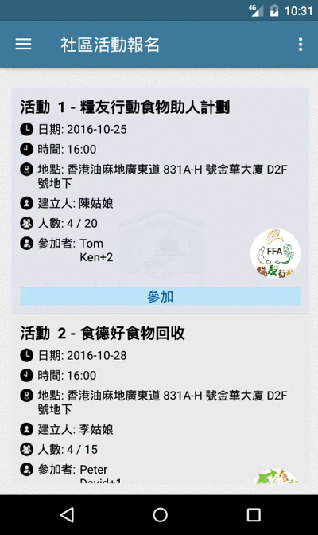
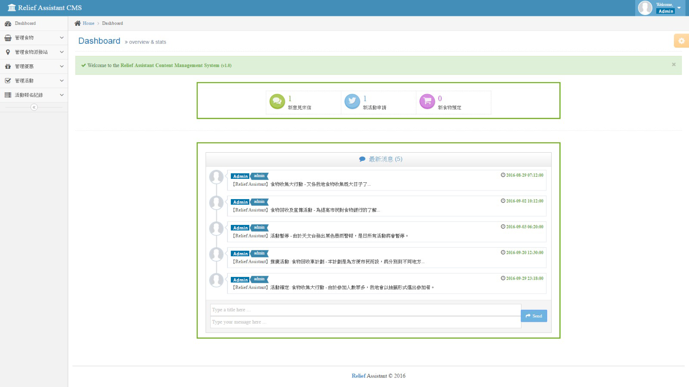

#  FoodEncyclopedia

> The China Mainland, Hong Kong and Macao Digital Economy Innovation and Entrepreneurship Competition 2016

> Android Application with CMS website (Content Management System)

[](https://travis-ci.org/alvinau0427/FoodEncyclopedia)
[](LICENSE)

## Getting Started
- Food Encyclopedia is a project to help citizens who have difficulty coping with daily food expenditures. It provides emergency and short-term dietary assistance. The dry food they supply includes rice, noodles, canned food, biscuits, and milk powder. Because these are the necessities of every family, many citizens want to know the more relevant information, such as the type of dry food, inventory, distribution station information. Because of this, we have developed a food bank management system through which citizens can query information about all food or delivery stations, as well as some back-up services.

## Features
- Food enquiries
- Food distribution station enquiries with Google map
- Discount enquiries with QR code release
- Event enquiries and registration
- Notification
- Customer Service

## Screenshots
| Home Page     | Event Page    |
| :-------------: | :-------------: |
|  |  |

| Coupon Page     | Notification    |
| :-------------: | :-------------: |
|  |  |

| CMS Website     |
| :-------------: |
|  |

## License
- FoodEncyclopedia is released under the [Apache Version 2.0 License](http://www.apache.org/licenses/LICENSE-2.0.html).
```
Copyright 2016 alvinau0427

Licensed under the Apache License, Version 2.0 (the "License");
you may not use this file except in compliance with the License.
You may obtain a copy of the License at

   http://www.apache.org/licenses/LICENSE-2.0

Unless required by applicable law or agreed to in writing, software
distributed under the License is distributed on an "AS IS" BASIS,
WITHOUT WARRANTIES OR CONDITIONS OF ANY KIND, either express or implied.
See the License for the specific language governing permissions and
limitations under the License.
